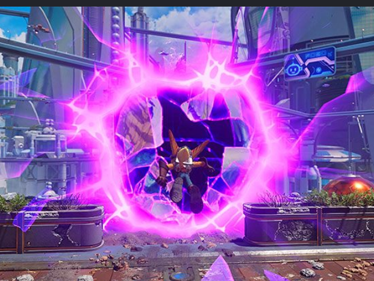

# Dimension Rift effect collaboration

Temporary collaboration repository for the current Ratchet & Clank Wiki Contents hover effect, captured on 2 October 2026. This is the selected main-page preview effect, including the gold-orange icon and label glow.

## Run the demo

Open `index.html` in a modern browser, or serve this folder:

```sh
python -m http.server 8000
```

Then open http://localhost:8000. Hover an icon or use Tab to focus a navigation link. Eleven items demonstrate the same treatment at actual navigation size. The Portal PNGs and Aguda Bold font load from the wiki CDN; internet access is required for them. The effect SVGs and reference image are included locally.

## Files to edit

- `rift.css`: demo geometry, selected effect, opening/pulse animation, gold-orange glow, and reduced-motion behavior.
- `assets/rift-portal.svg`: uneven pink rim, connected fracture network, purple glass slivers and glow layers in front of the icon.
- `assets/rift-aperture.svg`: dark opening behind the icon. Keep its opening path aligned with the frame.
- `index.html`: eleven labelled navigation links with explicit art areas and a separate decorative frame.
- `reference/rift-apart-reference.png`: user-supplied in-game design reference.
- `assets/sources.json`: original external icon URLs.
- `source/main-preview-rift.css`: unmodified source snapshot for integration context. The runnable demo extracts the relevant rules from this override and the main-page base CSS.

## Design target and handoff

Improve the portal's resemblance to the reference: a torn opening in a glass-like surface, with a broad saturated pink/magenta bloom, a readable sharp rim, unequal connected fracture cells, cracks extending outward, and translucent fragments near the edge. Avoid a regular polygon ring, disconnected lightning bolts, and conspicuous rectangular fragments. Outer detail should fade softly.

The selected effect has no rotation. Icons retain normal size at rest and shrink to 88% on hover/focus. Icons and labels glow gold-orange on selection. Keep these choices unless the collaborator requests a change. Keyboard focus triggers the same effect; reduced motion retains a static selected state and stops opening/pulse animation.

The last code changes softened blocky outer panes. Visual fidelity still needs the collaborator's judgment. Prior checks were code/DOM checks; the original user requested no visual review by the first agent.

Suggested next-agent prompt:

> Read AGENTS.md and README.md. Run index.html and improve the current Dimension Rift effect against reference/rift-apart-reference.png. Preserve the navigation structure, gold-orange selected icon/label treatment, slight icon shrink, keyboard support and reduced-motion state. Work primarily in rift.css and the two SVG assets. Explain your changes and provide a preview for review.

## Integration

The original design is a deferred Ratchet & Clank Wiki preview using `.rc-mp-*` classes. This demo does not migrate it into the shared `.mp-*` implementation. Changes need to be copied back to the selected preview and reconciled with the publish package. Wiki publication also requires usable uploaded URLs for the two SVG assets. Nothing here is installed on the wiki.

## Asset credits

The reference depicts Ratchet & Clank: Rift Apart by Insomniac Games/Sony Interactive Entertainment. It was supplied by the user for visual comparison. Portal art and the Aguda font URLs come from the [Ratchet & Clank Wiki](https://ratchetandclank.fandom.com/wiki/Category:Portal_images). Third-party artwork/font rights remain with their owners; this repository does not assign a blanket license to those assets.


